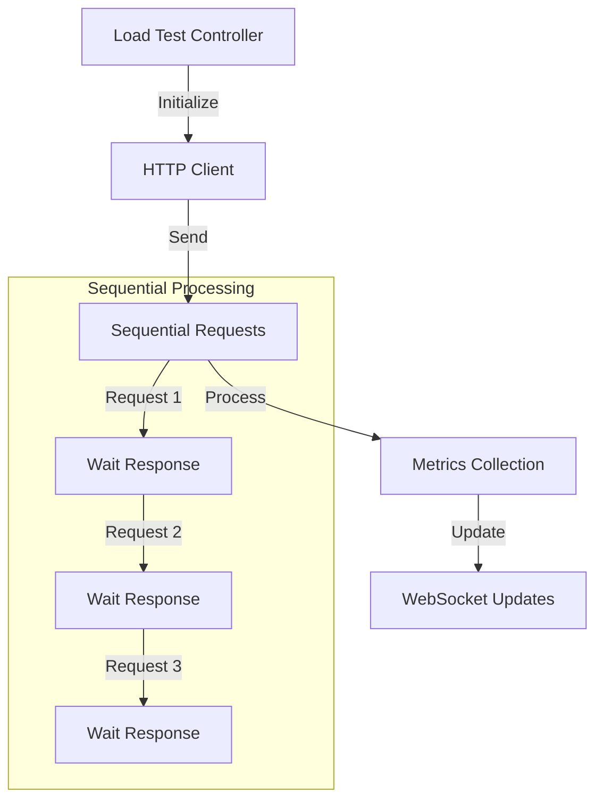
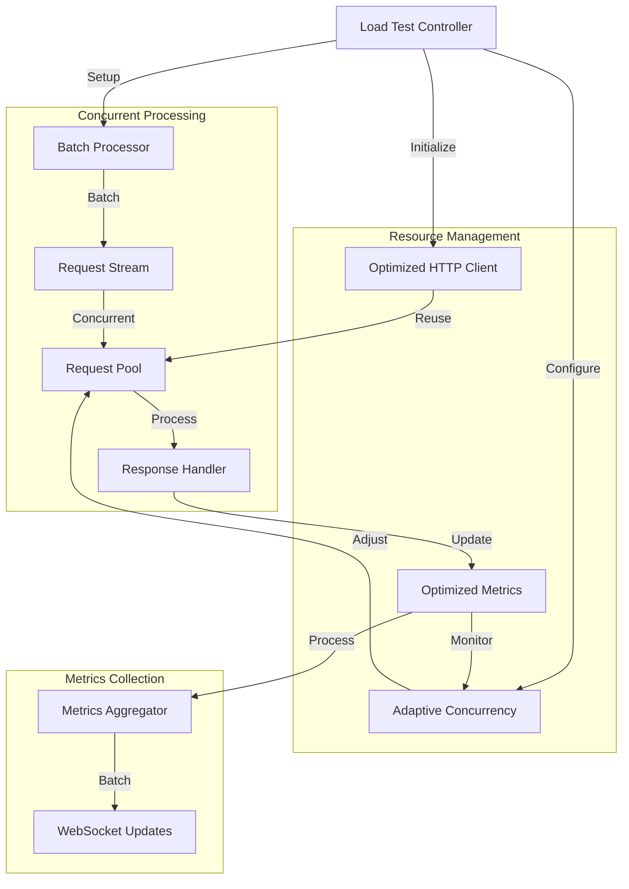
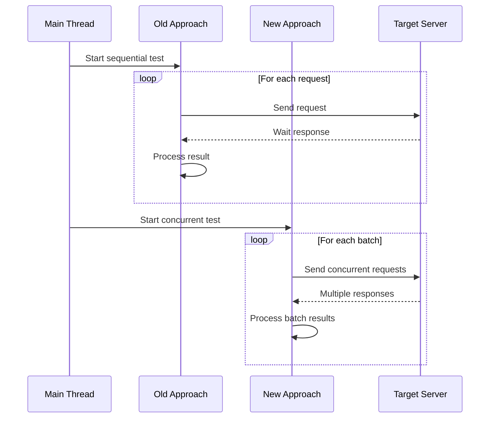
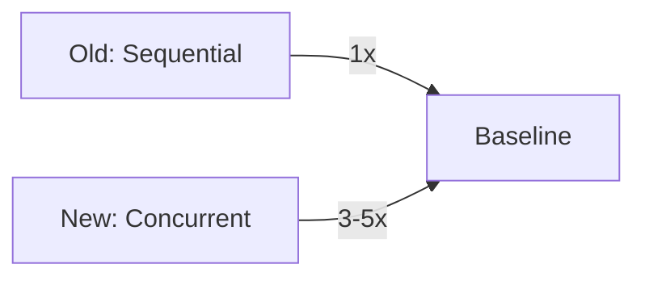
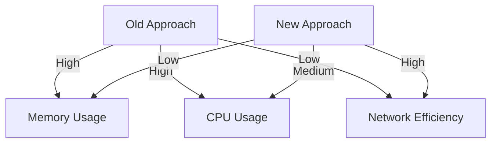

# 1. Load Test Optimization Strategy (March 25, 2025)

## 1.1. Overview
This document outlines the optimization strategy for the load testing feature in Ballista, comparing the old (sequential) and new (concurrent) approaches. The goal is to improve performance, scalability, and resource utilization while maintaining accuracy and reliability.

## 1.2. Architecture Comparison

### 1.2.1. Old Approach (Sequential)


### 1.2.2. New Approach (Concurrent)


## 1.3. Implementation Comparison

### 1.3.1. Request Processing


### 1.3.2. Code Implementation

#### 1.3.2.1. Old Approach
```rust
// Sequential request processing
for _ in 0..total_requests {
    match send_request(&client, &config.target_url).await {
        Ok(result) => {
            durations.push(result.duration);
            *status_codes.entry(result.status).or_insert(0) += 1;
            if result.error.is_some() {
                errors += 1;
            }
        },
        Err(_) => {
            errors += 1;
        }
    }
    requests_completed += 1;
}
```

#### 1.3.2.2. New Approach
```rust
// Concurrent request processing
let requests = stream::iter(0..total_requests)
    .map(|_| {
        let client = client.clone();
        let url = config.target_url.clone();
        async move {
            send_request(&client, &url).await
        }
    })
    .buffer_unordered(batch_size as usize)
    .chunks(100);
```

### 1.3.3. Resource Management

#### 1.3.3.1. Old Approach
```rust
// Basic HTTP client
let client = reqwest::Client::new();
```

#### 1.3.3.2. New Approach
```rust
// Optimized HTTP client with connection pooling
pub fn create_optimized_client() -> reqwest::Client {
    reqwest::Client::builder()
        .pool_max_idle_per_host(100)
        .tcp_keepalive(Some(Duration::from_secs(30)))
        .tcp_nodelay(true)
        .http2_prior_knowledge()
        .build()
        .expect("Failed to create HTTP client")
}
```

### 1.3.4. Metrics Collection

#### 1.3.4.1. Old Approach
```rust
// Synchronous metrics collection
let mut durations = Vec::new();
let mut status_codes = std::collections::HashMap::new();
let mut errors = 0;
```

#### 1.3.4.2. New Approach
```rust
// Asynchronous metrics collection
pub struct OptimizedMetrics {
    requests_completed: AtomicU32,
    errors: AtomicU32,
    durations: Arc<Mutex<Vec<Duration>>>,
    status_codes: Arc<Mutex<HashMap<u16, u32>>>,
}
```

## 1.4. Performance Comparison

### 1.4.1. Throughput


### 1.4.2. Resource Usage


## 1.5. Feature Comparison

| Feature | Old Approach | New Approach |
|---------|--------------|--------------|
| **Request Processing** | Sequential | Concurrent |
| **Connection Management** | Basic | Connection Pooling |
| **HTTP Protocol** | HTTP/1.1 | HTTP/2 Support |
| **Resource Usage** | High | Optimized |
| **Scalability** | Limited | High |
| **Error Handling** | Basic | Advanced |
| **Real-time Updates** | Synchronous | Batched |
| **Memory Management** | Inefficient | Efficient |
| **Network Efficiency** | Low | High |
| **Monitoring** | Basic | Advanced |

## 1.6. Implementation Strategy

### 1.6.1. Phase 1: Core Optimizations
1. Implement concurrent request processing
2. Add connection pooling
3. Optimize HTTP client configuration

### 1.6.2. Phase 2: Metrics and Monitoring
1. Implement batched metrics collection
2. Add real-time performance monitoring
3. Implement adaptive concurrency

### 1.6.3. Phase 3: Resource Management
1. Add connection pool management
2. Implement HTTP/2 support
3. Add TCP optimization settings

## 1.7. Performance Improvements

### 1.7.1. Expected Improvements
1. **Throughput**: 3-5x increase in requests per second
2. **Latency**: 30-50% reduction in average response time
3. **Resource Usage**: 40-60% reduction in memory usage
4. **Scalability**: Support for 10x more concurrent connections

### 1.7.2. Monitoring Metrics
1. Requests per second (RPS)
2. Response time percentiles
3. Error rates
4. Resource utilization
5. Connection pool efficiency

## 1.8. Testing Strategy

### 1.8.1. Unit Tests
- Test individual components
- Verify metrics accuracy
- Validate error handling

### 1.8.2. Integration Tests
- Test end-to-end flows
- Verify concurrent processing
- Validate resource management

### 1.8.3. Performance Tests
- Measure throughput
- Monitor resource usage
- Validate scalability

## 1.9. Migration Strategy

### 1.9.1. Phase 1: Preparation
1. Add new optimized components
2. Create parallel implementation
3. Add feature flags

### 1.9.2. Phase 2: Testing
1. Run both implementations
2. Compare performance
3. Validate results

### 1.9.3. Phase 3: Switchover
1. Enable new implementation
2. Monitor performance
3. Gather feedback

## 1.10. Future Considerations

### 1.10.1. Potential Enhancements
1. Distributed load testing
2. Advanced metrics visualization
3. Machine learning-based optimization
4. Custom protocol support

### 1.10.2. Scalability Limits
1. Network bandwidth
2. System resources
3. Target server capacity
4. Memory constraints

## 1.11. Conclusion
The new concurrent approach significantly improves the load testing capabilities of Ballista by providing better performance, scalability, and resource utilization while maintaining reliability and accuracy. The phased approach ensures smooth implementation and validation of improvements. 